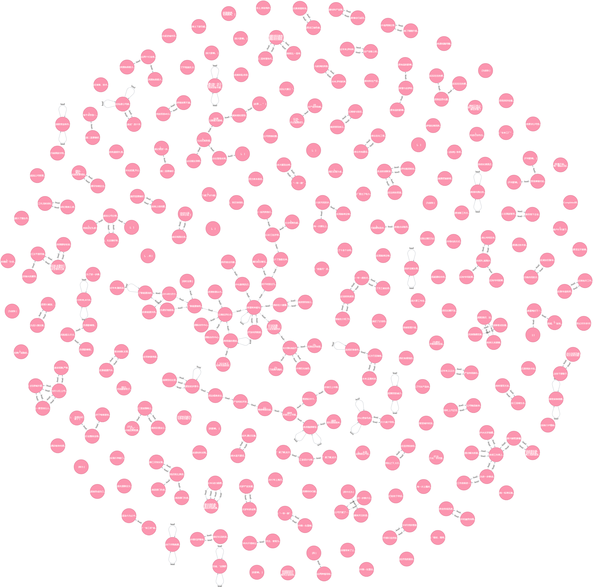

# EventEvolutionaryGraph
#### Example of codes for constructing  event evolutionary graph.  
- 因果事件对的抽取，抽取出因果关系子对。
- 对因果关系子对中的事件进行融合。
- 利用融合后得到的结果生成事理图谱的节点和边。
- 利用图数据库进行数据的存储，事理图谱的可视化展示等等。
- 通过Graph Embeding技术利用事理图谱进行事件预测。  

